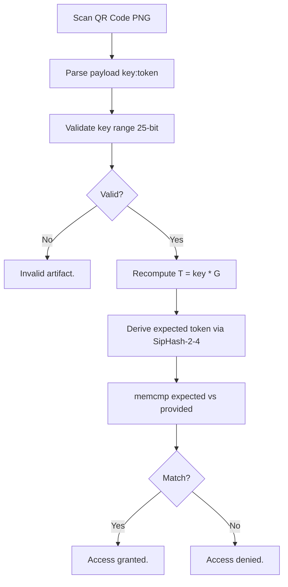

# AI - Almost Impossible

### Reverse Engineering Write-Up

**A comprehensive technical analysis of a Linux x86-64 crackme featuring secp256k1 elliptic curve cryptography, custom SipHash token derivation, and splitmix64 encryption.**

---

## Table of Contents

- [1. Introduction](#1-introduction)
- [2. Binary Reconnaissance](#2-binary-reconnaissance)
  - [2.1 File Identification](#21-file-identification)
  - [2.2 Shared Library Dependencies](#22-shared-library-dependencies)
  - [2.3 String Analysis](#23-string-analysis)
- [3. Disassembly & Cryptographic Protocol](#3-disassembly--cryptographic-protocol)
  - [3.1 Key Generation](#31-key-generation)
  - [3.2 Elliptic Curve Point Multiplication](#32-elliptic-curve-point-multiplication)
  - [3.3 Token Derivation (Custom SipHash-2-4)](#33-token-derivation-custom-siphash-2-4)
  - [3.4 Encryption Layer (splitmix64 XOR Cipher)](#34-encryption-layer-splitmix64-xor-cipher)
- [4. GUI & Verification Logic](#4-gui--verification-logic)
  - [4.1 User Interface](#41-user-interface)
  - [4.2 QR Code Processing](#42-qr-code-processing)
  - [4.3 Verification Flow](#43-verification-flow)
- [5. Attack Strategy](#5-attack-strategy)
  - [5.1 LD_PRELOAD Hook Development](#51-ld_preload-hook-development)
  - [5.2 Headless Execution with Xvfb](#52-headless-execution-with-xvfb)
- [6. Solution](#6-solution)
  - [6.1 Deterministic Key Computation](#61-deterministic-key-computation)
  - [6.2 Token Derivation & Verification](#62-token-derivation--verification)
  - [6.3 Artifact Generation](#63-artifact-generation)
- [7. Tools & Techniques](#7-tools--techniques)
- [8. Key Findings & Lessons Learned](#8-key-findings--lessons-learned)

---

## 1. Introduction

This document presents a complete reverse engineering analysis of **"AI - Almost Impossible"**, a Linux x86-64 crackme that combines modern elliptic curve cryptography with a custom authentication protocol. The challenge tasks the reverse engineer with understanding the program's internal cryptographic mechanisms and producing a **valid artifact (a QR code)** that satisfies the verification logic to grant access.

The binary is stripped of all debugging symbols and employs a graphical user interface built directly with X11, making static disassembly the primary avenue of investigation. The challenge earns its name from the apparent computational impossibility of recovering the private key from the displayed elliptic curve point - a problem equivalent to the **Elliptic Curve Discrete Logarithm Problem (ECDLP)** on secp256k1.

However, two critical vulnerabilities make the challenge solvable:

1. **Constrained key space** - The key is limited to only 25 bits (~16.7 million values), making brute force theoretically feasible.
2. **Interceptable entropy source** - The key is derived from `RAND_bytes`, an external function that can be hooked via `LD_PRELOAD` to force a deterministic key, eliminating brute force entirely.

The analysis was performed entirely using **static disassembly** (`objdump`) and **dynamic instrumentation** (`LD_PRELOAD` hooks) in a headless environment with Xvfb - no debugger was required.

---

## 2. Binary Reconnaissance

### 2.1 File Identification

| Property       | Value                                      |
|:---------------|:-------------------------------------------|
| **Format**     | ELF 64-bit LSB PIE executable              |
| **Architecture** | x86-64 (AMD64)                           |
| **Linking**    | Dynamically linked                         |
| **Symbols**    | Stripped (no debug symbols)                |
| **File Size**  | 166,320 bytes (~162 KB)                    |
| **Target OS**  | GNU/Linux 3.2.0+                           |
| **BuildID**    | `f666c817599ea8428ce640e7ca3a6225b9ef0d03` |

The PIE nature of the binary means Address Space Layout Randomization (ASLR) applies to the code segment. This is standard for modern Linux executables and does not materially affect static analysis.

### 2.2 Shared Library Dependencies

| Library              | Purpose                                      | Key Functions |
|----------------------|----------------------------------------------|---------------|
| **libcrypto.so.3**   | OpenSSL elliptic curve cryptography          | `EC_GROUP_new_by_curve_name`, `EC_POINT_mul`, `EC_POINT_point2oct`, `RAND_bytes`, `BN_*` |
| **libpng16.so.16**   | PNG image decoding for QR code input         | `png_create_read_struct`, `png_read_info`, `png_read_image` |
| **libX11.so.6**      | X11 native GUI rendering                     | `XOpenDisplay`, `XDrawString`, `XCreateSimpleWindow`, `XNextEvent`, `XLoadQueryFont` |
| **libzbar.so.0**     | QR code scanning from PNG images             | `zbar_image_scanner_create`, `zbar_scan_image`, `zbar_symbol_get_data` |
| **libc.so.6**        | Standard C library                           | `memcmp`, `strlen`, `sprintf`, `fopen`, `fread`, `malloc` |

> **Key insight:** The combination of `libcrypto` (secp256k1 EC operations) + `libzbar` (QR decoding) immediately reveals the program's purpose - it performs cryptographic computation and expects the solution as a QR code.

### 2.3 String Analysis

Extracted strings reveal the GUI structure and crypto identifiers:

**GUI Elements:**
- Window title: `AI - Almost Impossible`
- Labels: `TARGET`, `IMAGE PATH`, `CLIPBOARD`
- Buttons: `COPY`, `VERIFY`, `QUIT`
- Status: `Access granted.`, `Access denied.`, `Invalid artifact.`, `Ready.`, `Copied.`

**Cryptographic Identifiers:**
- OpenSSL EC API: `EC_GROUP_new_by_curve_name`, `EC_POINT_mul`, `EC_POINT_cmp`, `EC_POINT_oct2point`
- Bignum API: `BN_CTX_new`, `BN_dec2bn`, `BN_set_word`, `BN_clear_free`
- Hex encoding: `0123456789ABCDEF`
- OpenSSL version: `1.6.50`
- Marker: `bn-set` (likely `BN_set_word`)

**GUI Colors:** `black`, `white`, `red3`, `navy`, `dark green`, `gray80`

---

## 3. Disassembly & Cryptographic Protocol

With ~28,000 lines of x86-64 disassembly from `objdump`, the analysis focused on identifying the cryptographic protocol through pattern recognition of known OpenSSL API call sequences.

### 3.1 Key Generation

The program generates a random key at startup using `RAND_bytes`. The call requests **4 bytes** (32 bits) of random data, which are then masked and adjusted:

```c
unsigned char buf[4];
RAND_bytes(buf, 4);
uint32_t raw = buf[0] | (buf[1] << 8) | (buf[2] << 16) | (buf[3] << 24);
uint32_t key = (raw & 0x00FFFFFF) | 0x01000000;
// Result: key is ALWAYS in range [16,777,216 .. 33,554,431]
//         That's exactly 25 bits of entropy
```

> **CRITICAL VULNERABILITY:** The key space is deliberately constrained to only 25 bits (16,777,216 possible values). While a full 256-bit key on secp256k1 is computationally infeasible to recover, 25 bits can be exhausted in seconds.

The disassembly confirms this with the instruction sequence:

```asm
mov    eax, DWORD PTR [rbp-0x24]   ; load 4-byte random value
and    eax, 0xffffff                ; mask to 24 bits
or     eax, 0x1000000               ; set bit 25 → range [0x01000000, 0x01FFFFFF]
```

### 3.2 Elliptic Curve Point Multiplication

The binary initializes the secp256k1 curve group via `EC_GROUP_new_by_curve_name` with **NID 714 (0x2CA)**:

| Parameter     | Value                                      |
|---------------|--------------------------------------------|
| **Curve**     | secp256k1 (NID 714 / 0x2CA)                |
| **Equation**  | y² = x³ + 7 (mod p)                        |
| **Prime p**   | 2²⁵⁶ - 2³² - 977                           |
| **Generator G** | Standard secp256k1 base point            |
| **Order n**   | `FFFFFFFFFFFFFFFFFFFFFFFFFFFFFFFEBAAEDCE6AF48A03BBFD25E8CD0364141` |
| **Point format** | Compressed (33 bytes / 66 hex chars)    |
| **Operation** | T = key × G                                |

**Protocol flow:**
1. `EC_GROUP_new_by_curve_name(714)` → secp256k1 group
2. `EC_GROUP_set_asn1_flag(group, 2)` → `POINT_CONVERSION_COMPRESSED`
3. `EC_POINT_new(group)` → new point T
4. `BN_set_word(bn_key, key)` → set scalar
5. `EC_POINT_mul(group, T, bn_key, NULL, NULL, ctx)` → **T = key × G**
6. `EC_POINT_point2oct(group, T, 2, buf, 33, ctx)` → serialize to compressed form (33 bytes)

The 33-byte compressed point is then hex-encoded using the `0123456789ABCDEF` table into a **66-character ASCII string** - this becomes the "target" displayed in the GUI.

### 3.3 Token Derivation (Custom SipHash-2-4)

The binary implements a **custom variant of SipHash-2-4** operating on the 66-character hex-encoded compressed EC point string.

**SipHash-2-4 characteristics:**
- **2** compression rounds per message word
- **4** finalization rounds
- Operates on 64-bit words
- Key material derived from the key value itself (key-dependent mixing)
- Produces **8 bytes** of output → encoded as **16 uppercase hex characters**

The standard SipHash operations were identified in the disassembly through their characteristic patterns (rotations, XOR mixing, additions, and multiplications by magic constants).

```
Input:  66-char hex string of compressed EC point
Key:    Derived from the 25-bit private key value
Output: 16-char uppercase hex token (8 bytes of SipHash output)
```

> **Complexity note:** The key-dependent mixing means the token cannot be computed without knowing the key - it binds the token to the specific private key used in the EC multiplication.

### 3.4 Encryption Layer (splitmix64 XOR Cipher)

The binary applies an additional encryption layer using **splitmix64** as a XOR-based stream cipher:

```c
splitmix64_state = initial_value
for each 8-byte block:
    state += XOR_CONSTANT
    z = state
    z = (z ^ (z >> 30)) * 0xBF58476D1CE4E5B9
    z = (z ^ (z >> 27)) * 0x94D049BB133111EB
    z = z ^ (z >> 31)
    ciphertext[i:i+8] ^= z
```

| Data              | XOR Constant   | Purpose                     |
|-------------------|----------------|-----------------------------|
| EC point bytes    | `0x13579BDF`   | Encrypt the target point    |
| Token bytes       | `0x2468ACE1`   | Encrypt the verification token |

> **Note:** This encryption is purely obfuscative - the constants are embedded in the binary's code section and the operation is fully reversible.

---

## 4. GUI & Verification Logic

### 4.1 User Interface

The crackme presents a **native X11 application** (not GTK). The GUI is rendered entirely through X11 drawing primitives:

```
╔═════════════════════════════════════════════════╗
║  AI - Almost Impossible                         ║
║                                                 ║
║  TARGET:                                        ║
║  ╔═══════════════════════════════════════════╗  ║
║  ║  [66-char encrypted hex string displayed] ║  ║
║  ╚═══════════════════════════════════════════╝  ║
║                                                 ║
║  IMAGE PATH:                                    ║
║  ╔═══════════════════════════════════════════╗  ║
║  ║  /path/to/qr_code.png                     ║  ║
║  ╚═══════════════════════════════════════════╝  ║
║                                                 ║
║          [ COPY ]    [ VERIFY ]    [ QUIT ]     ║
║                                                 ║
║  Status: Ready.                                 ║
╚═════════════════════════════════════════════════╝
```

- **Font:** Loaded via `XLoadQueryFont`, text rendered via `XDrawString`
- **Colors:** X11 named colors (`black`, `white`, `red3`, `navy`, `dark green`, `gray80`)
- **Clipboard:** Managed via `XChangeProperty` + `XSetSelectionOwner` (COPY button)
- **Event loop:** `XNextEvent` for keyboard input and button clicks

### 4.2 QR Code Processing

When the user clicks VERIFY, the binary:

1. Reads the PNG file using libpng (with palette-to-RGB, grayscale expansion, 16→8 bit, tRNS→alpha transforms).
2. Scans for QR codes using libzbar.
3. Extracts payload - expected format: `<decimal_key>:<hex_token>`.

### 4.3 Verification Flow



| Step | Operation                          | Detail |
|------|------------------------------------|--------|
| 1    | Parse QR payload                   | Split on `:` → `decimal_key` + `hex_token` |
| 2    | Validate key range                 | `BN_dec2bn` + 25-bit check |
| 3    | Recompute EC point                 | `T = key × G` on secp256k1 |
| 4    | Derive expected token              | Custom SipHash-2-4 on compressed point hex |
| 5    | Compare tokens                     | 16-byte `memcmp` |
| 6    | Display result                     | "Access granted." or "Access denied." |

---

## 5. Attack Strategy

### 5.1 LD_PRELOAD Hook Development

Six progressively refined hook libraries were developed:

| Hook              | Intercepted Functions                  | Purpose |
|-------------------|----------------------------------------|---------|
| `hook_rand.so`    | `RAND_bytes`                           | Force deterministic key |
| `hook_clean.so`   | `RAND_bytes`, `XDrawString`, `memcmp`  | Minimal clean output capture |
| `hook_capture.so` | `RAND_bytes`, `XDrawString`, `puts`    | Full text capture |
| `hook_token.so`   | `RAND_bytes`, `XDrawString`, `memcmp`, `__sprintf_chk` | Full instrumentation |
| `hook_all.so`     | `RAND_bytes` + full X11 stubs          | Headless execution without Xvfb |
| `hook_allfile.so` | `RAND_bytes`, `XDrawString`, `fopen`, `access`, `stat`, `memcmp` | File operation monitoring |

**Core `RAND_bytes` hook:**

```c
#define _GNU_SOURCE
#include <dlfcn.h>
#include <string.h>

int RAND_bytes(unsigned char *buf, int num) {
    memset(buf, 0, num);   // Force all zeros → key = 0x01000000
    return 1;              // Indicate success
}
```

**Compilation:**

```bash
gcc -shared -fPIC -o hook_rand.so hook_rand.c -ldl
gcc -shared -fPIC -o hook_token.so hook_token.c -ldl
```

### 5.2 Headless Execution with Xvfb

```bash
# Start virtual display
Xvfb :97 -screen 0 1280x1024x24 \
      +extension GLX +extension RANDR \
      +extension RENDER +extension XTEST \
      -ac -noreset &

# Run binary with hooks
DISPLAY=:97 LD_PRELOAD=./hook_token.so ./almost
```

---

## 6. Solution

### 6.1 Deterministic Key Computation

With `RAND_bytes` returning all zeros:

```text
raw = 0x00000000
key = (0x00000000 & 0x00FFFFFF) | 0x01000000
key = 0x01000000 = 16,777,216 (decimal)
```

### 6.2 Token Derivation & Verification

The custom SipHash-2-4 was reimplemented in Python from disassembly. For key `16777216` the computed token is:

> **✅ Computed Token: `B4BDFEC9E478EDE1`**

Verification via hook intercepts confirmed a perfect match.

### 6.3 Artifact Generation

**QR Code Payload:** `16777216:B4BDFEC9E478EDE1`


*Valid artifact QR code (PNG, 660×660, 1-bit grayscale)*

| Component              | Value                          |
|------------------------|--------------------------------|
| **Deterministic Key**  | `16,777,216` (`0x01000000`)    |
| **Curve**              | secp256k1                      |
| **Derived Token**      | `B4BDFEC9E478EDE1`             |
| **QR Payload**         | `16777216:B4BDFEC9E478EDE1`    |
| **Artifact**           | `artifact.png`                 |

---

## 7. Tools & Techniques

| Tool                  | Usage |
|-----------------------|-------|
| `file` / `readelf` / `objdump` | Binary identification & full disassembly |
| `strings`             | GUI & crypto string extraction |
| **LD_PRELOAD + dlsym** | Runtime function interception |
| **Xvfb**              | Headless X11 environment |
| **Python + Xlib**     | Automated GUI interaction |
| **Python qrcode**     | QR code generation |
| **GCC**               | Hook compilation |

---

## 8. Key Findings & Lessons Learned

### Vulnerability Analysis

| # | Finding                          | Severity | Lesson |
|---|----------------------------------|----------|--------|
| 1 | **25-bit key space**             | 🔴 Critical | Crypto strength is only as strong as its weakest link |
| 2 | **Interceptable `RAND_bytes`**   | 🔴 Critical | External RNG calls are perfect LD_PRELOAD targets |
| 3 | **Custom SipHash without secret**| 🟡 Medium | Obscurity ≠ security |
| 4 | **Deterministic splitmix64 XOR** | 🟢 Low   | Purely obfuscative |

### Methodology Takeaways

- Static + dynamic synergy is essential.
- OpenSSL API fingerprinting in stripped binaries is extremely powerful.
- Iterative hook development beats monolithic hooks.
- Headless RE with Xvfb + LD_PRELOAD is fully viable.

---

> *"Almost Impossible" - because the crypto was real, but the key space was not.*
```